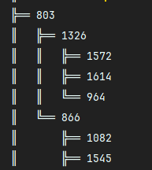
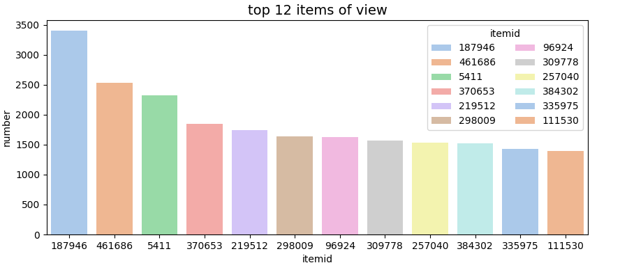
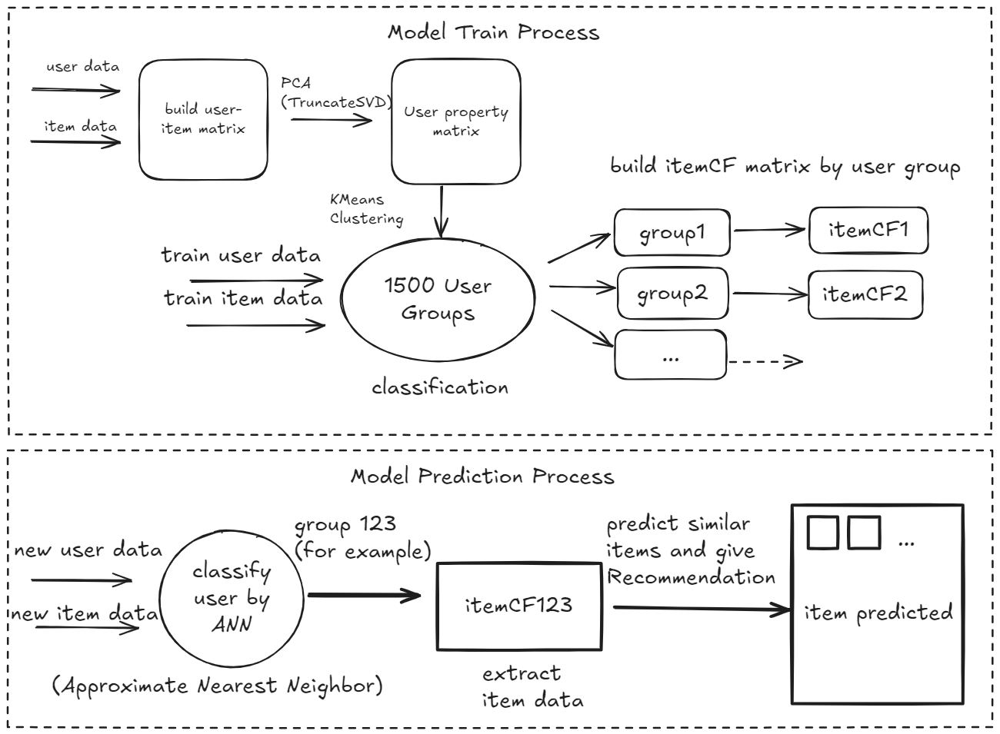
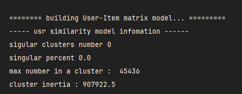
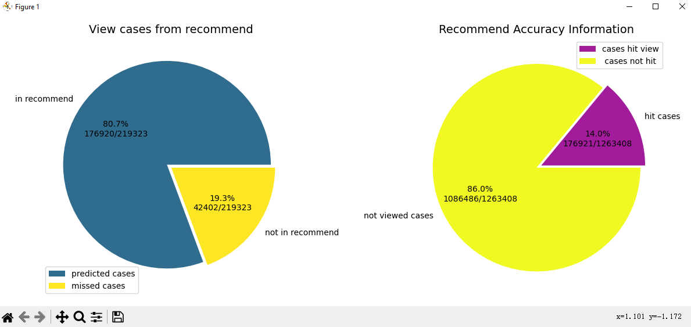

# Ecommerce Recommendation System

### Introduction

😃 This code is a simple **recommendation system**, also a good practice for beginners.

### Dataset and Purpose

This project uses the [Retailrocket Recommender System Dataset](https://www.kaggle.com/datasets/retailrocket/ecommerce-dataset) from Kaggle. The dataset includes **2,756,101 events**, categorized as:

- **2,664,312 views**
- **69,332 add-to-cart actions**
- **22,457 transactions**

These events are produced by **1,407,580 unique visitors**.

Instead of focusing on the prediction tasks suggested by the dataset, this recommendation system emphasizes:

1. **User-User Collaborative Filtering (UserCF):** Creating a user-based collaborative filtering matrix.
2. **Item-Item Collaborative Filtering (ItemCF):** Building an item-based collaborative filtering matrix.
3. **Behavior Prediction:** Predicting user view behavior within the partition of items they have already interacted with. 

### Getting Started

Run the script `rocket_market.py` located in the `src` folder to generate the UserCF and ItemCF matrices and perform behavior predictions.

1. Firstly the code would use `treelib` to show following tree view of categories tree, if you don't have it, use `pip installl treelib` or directly comment  `self.__get_category_tree()` if no need to show.  



> note : if messy code happens, see [my blog](https://blog.csdn.net/sbsbsb666666/article/details/142212249?spm=1001.2014.3001.5501) for solution

2. Secondly it shows **the top-k  items of view, addtocart and transaction**, similar code can be found at  [recommender-system-for-beginners](https://www.kaggle.com/code/aafrin/retail-rocket-recommender-system-for-beginners) 



3. Then it would build the main recommendation system model, which would be explained in detail later. 

### How the model works

The model train process and prediction are explained in the following figure : 



### Model Parameters

parameter settings are the following code :

```python
self.cluster_number = 1500     # user group number (used for kmeans cluster)
self.kmeans_batch_size = 4000  # Minibatch kmeans batchsize
self.n_components = 50         # for TruncatedSVD (PCA components)
self.max_recommend_item = 10   # maximum recommendation 10 items for each item related
```

we use the whole view dataset for train this model, and use 70% viewed items to predict another 30% items , this can be configured in the following code:

```python
self.train_recommend_model(data, train_size = 1)
self.test_recommend_model(data, test_usr_size=0.9, test_itm_size=0.3, k_filter=3)
```

#### Key Parameters

During the training process,  the model's building information would be printed as shown below :



1. **Singular Cluster Number:**  
   Refers to clusters with sizes smaller than the `singular_threshold`.
   
   - **Action:** If the number of singular clusters is too high, **decrease** `self.cluster_number` to reduce the occurrence of these small clusters.

2. **Maximum Number in a Cluster:**  
   Refers to the largest cluster size.
   
   - **Action:** If this value is too large, **increase** `self.cluster_number` to balance the clusters and prevent the ItemCF matrix from becoming excessively large. 

3. **cluster inertia**:
    Refers to the min square error in one cluster 
   
   - this gives a cluster error result, smaller is good but not always best. 
   - this info is not so critical

### Model Prediction Results

**Model Training Time** : about 5 minutes (292 seconds) 

**Prediction Recall Rate** :   about 80 % 

**Prediction Precision** :  about 14 % 

the information after train the model are listed in the following figure : 



note that the recommend system may get a lower recall rate when predict the add_to_cart behavior (about 60% to 70%) 
